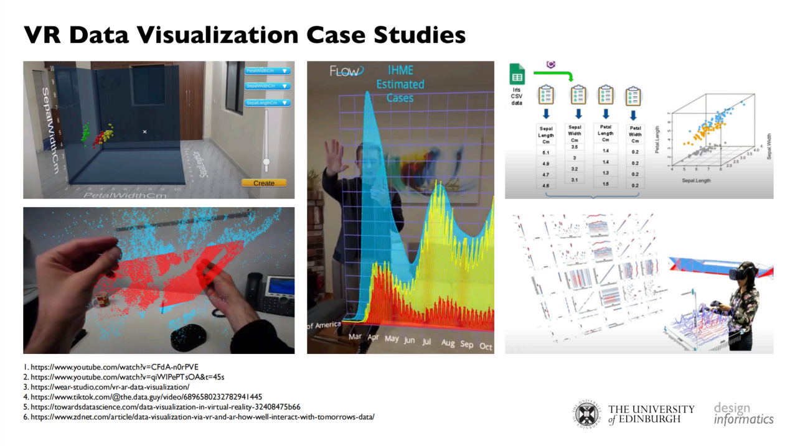
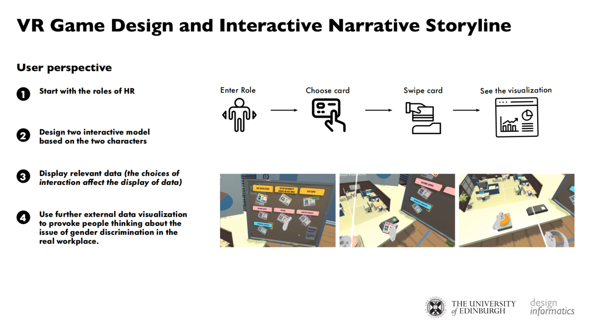

# Data-science-VR
A virtual reality app for displaying and interacting with workspace data.

Please download the installation APK file through the following link：[download](https://1drv.ms/u/s!AlAOIOBwskGHwUmfohK9czWqqY1o?e=5ZnCz0 )

Our introduction video:[video](https://www.youtube.com/watch?v=3gDpF5CvwYI)

## 1.Case-Study-before-development

  
## 2.Our-Story-line-about-data

  
## 3.Interaction-with-data

